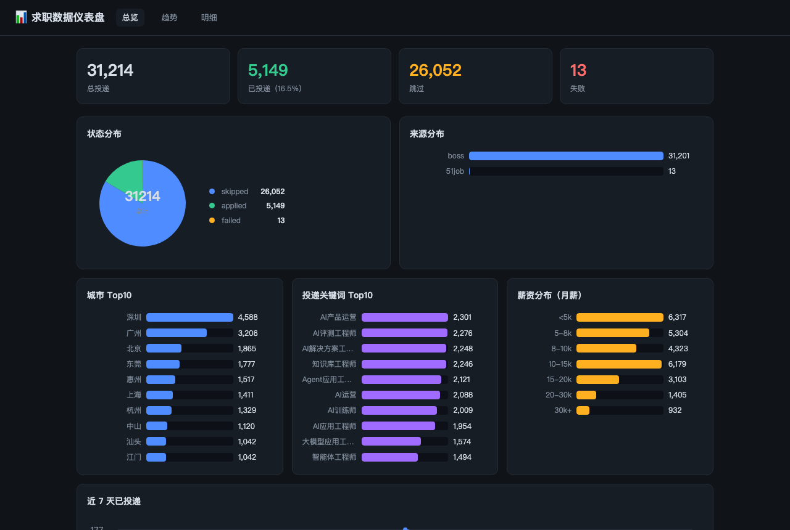
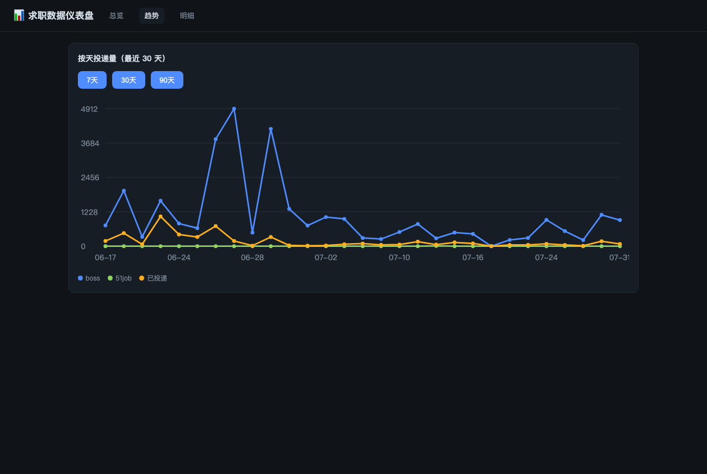

# 📊 求职数据仪表盘

一个本地运行的 Web 应用：把自动化投递产生的 **4 万+ 条求职记录**变成可视化仪表盘——总览、趋势、明细筛选。用于看清"投了什么、投到哪、结果如何"，用数据代替感觉做求职决策。

<p align="center">
  <b>🌐 AI 智能求职全链路套件 (Job Intelligence Suite)</b><br>
  <a href="https://github.com/Liooo0/boss-zhipin-helper">🧩 浏览器扩展 (JD即时提炼/AI回复)</a>
  &nbsp;•&nbsp;
  <a href="https://github.com/Liooo0/job-hunter">🎯 Job Hunter (规则引擎/精准拟真投递)</a>
  &nbsp;•&nbsp;
  <b>📊 决策仪表盘 (3万+投递数据复盘)</b>
</p>

<p align="center">
  
  
  
  
</p>

> 深色主题 · 零构建原生前端 · FastAPI + SQLite（只读）· 自写 SVG 图表（零依赖）

## 界面截图





## 功能

| 页面 | 内容 |
| --- | --- |
| 📊 总览 `/` | KPI（总投递/已投/跳过/失败）、状态环形图、来源/城市/关键词 Top10、薪资分布直方图、近7天投递折线 |
| 💡 洞察 `/insights` | **决策层**：跳过归因(哪些排除规则砍掉最多机会)、投递质量分布(JD 匹配分三段)、高分城市/关键词排行、投递薪资中位、30 天匹配分趋势 |
| 📈 趋势 `/trend` | 按天投递量折线（来源拆分 + 已投递数），7/30/90 天切换 |
| 📋 明细 `/detail` | 全字段表格 + 城市/来源/状态/关键词筛选 + 分页 |

## 数据源

只读 `jobintel/data/jobintel.db`（由自动化投递脚本写入，仪表盘永不改数据）。数据同步以投递主库 `~/projects/job-hunter/ab_experiment.db` 为准（JSON 日志 2026-08 起停更），更新数据：

```bash
cd ~/projects/jobintel && python3 src/sync_from_main_db.py
```

```sql
applications(id, source, status, city, company, job,
             salary_raw, salary_min_k, salary_max_k, salary_unit, salary_months,
             score, keyword, reason, error, ts)
```

## 运行

```bash
cd ~/projects/jobintel-dashboard
python3 -m venv venv && source venv/bin/activate
pip install -r requirements.txt
uvicorn app:app --host 127.0.0.1 --port 8001
```

打开 http://127.0.0.1:8001 （数据源路径可用环境变量 `JOBINTEL_DB` 覆盖）。

## 技术说明

- **只读安全**：所有查询是 `SELECT`，连接即用即关
- **图表零依赖**：donut/bar/line 全部自写 SVG 渲染，无 CDN、离线可用
- **薪资归一化**：K / 万 / 元/月 / 元/天 统一折算为月薪（K）再分桶
- 与 [llm-arena](https://github.com/Liooo0/llm-arena) 同款技术栈（FastAPI + 原生前端 + SQLite），面试可讲同一套故事

## 需求与迭代

详见 [docs/requirements.md](docs/requirements.md)（v0.2 已落地：决策洞察页 + `/api/insights`；后续：接 job-hunter 失败追踪库做回复率漏斗、周报自动生成）。

## 安全

纯本地运行；若暴露到局域网/公网，需先加鉴权（参考 llm-arena 的 `LLM_ARENA_ADMIN_TOKEN` 模式）。
